# TP — Linux Server, SSH, Docker, Jenkins & GitHub

## Informations

| Élément             | Valeur                    |
| ------------------- | ------------------------- |
| Système serveur     | Debian13 - 6.12.107       |
| Machine physique    | Linux                     |
| Docker              | Installé                  |
| Jenkins             | Installé                  |
| GitHub              | Configuration SSH activée |

---

# 13. Dockeriser le projet web-cv avec nginx

Le projet est un site statique HTML, CSS et JavaScript. Le fichier `web-cv/Dockerfile` utilise l'image légère `nginx:alpine` et copie les fichiers du site dans le répertoire servi par nginx, `/usr/share/nginx/html/`. Le site est donc disponible sur le port `80` du conteneur.

### Capture d'écran — Dockerfile

<!-- Remplacer ce placeholder par une capture du fichier web-cv/Dockerfile. -->
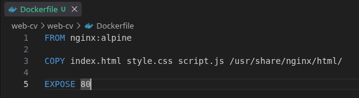

---

# 12. Créer une image Docker du projet

Construire l'image puis lancer un conteneur :


L'option `-t` attribue le nom et la version `web-cv:1.0` à l'image. Le port `8080` de la machine est redirigé vers le port `80` servi par nginx dans le conteneur. Le site est accessible à l'adresse `http://localhost:8080`.

### Capture d'écran — Commandes de création et lancement de l'image

<!-- Remplacer ce placeholder par une capture des commandes et de leur résultat. -->
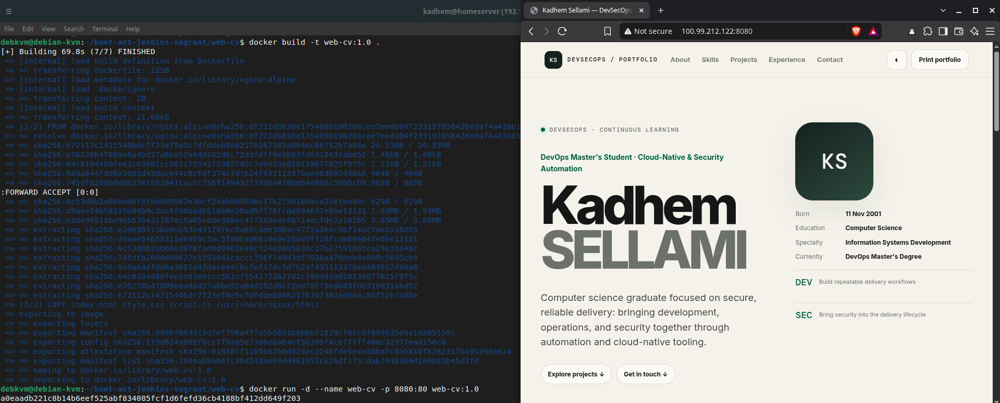

---

# 11. Lancer le projet avec Docker Compose

Le fichier `web-cv/compose.yaml` décrit la construction de la même image et la redirection du port `8080` vers le port `80` du conteneur. Depuis le dossier `web-cv/web-cv`, exécuter :

Si le conteneur lancé directement à l'étape 12 existe encore, le supprimer avant de démarrer Compose, car les deux configurations utilisent le nom `web-cv` :

```bash
docker stop web-cv
docker rm web-cv
```

Puis lancer Compose :

```bash
docker compose up -d --build
docker compose ps
```

L'option `--build` construit l'image à partir du Dockerfile avant le démarrage. La commande `ps` permet de vérifier l'état du service. Le site est accessible à l'adresse `http://localhost:8080`. Pour arrêter et supprimer le conteneur créé par Compose :

```bash
docker compose down
```

### Capture d'écran — Commandes Docker Compose

<!-- Remplacer ce placeholder par une capture des commandes Compose et de leur résultat. -->
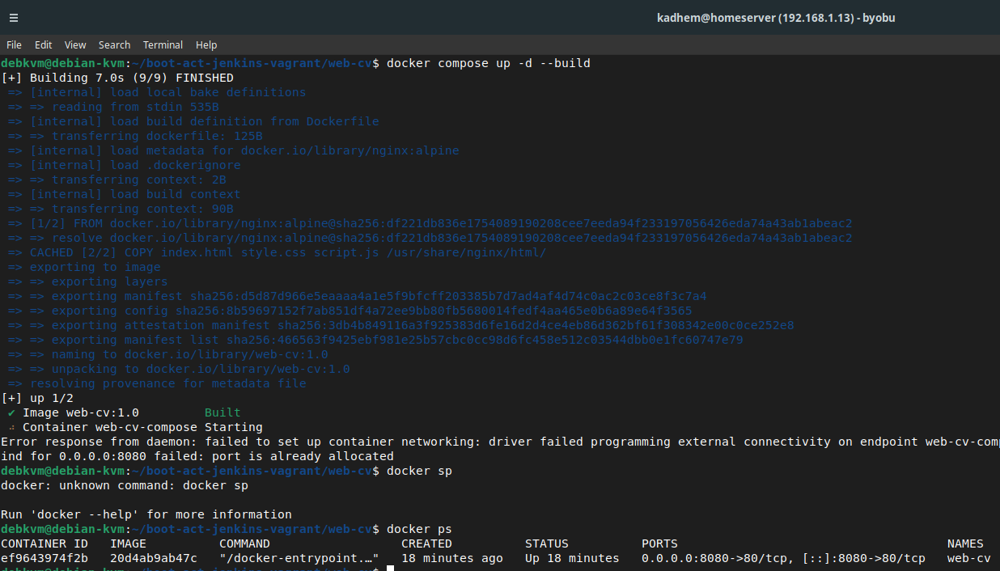

---

# 10. Évolution du mini-CV vers DevSecOps Portfolio
## 10.1. New Website State
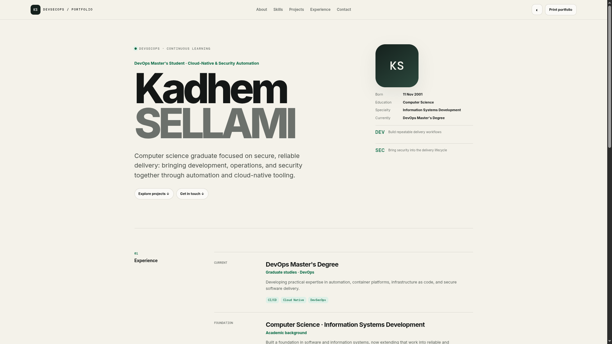
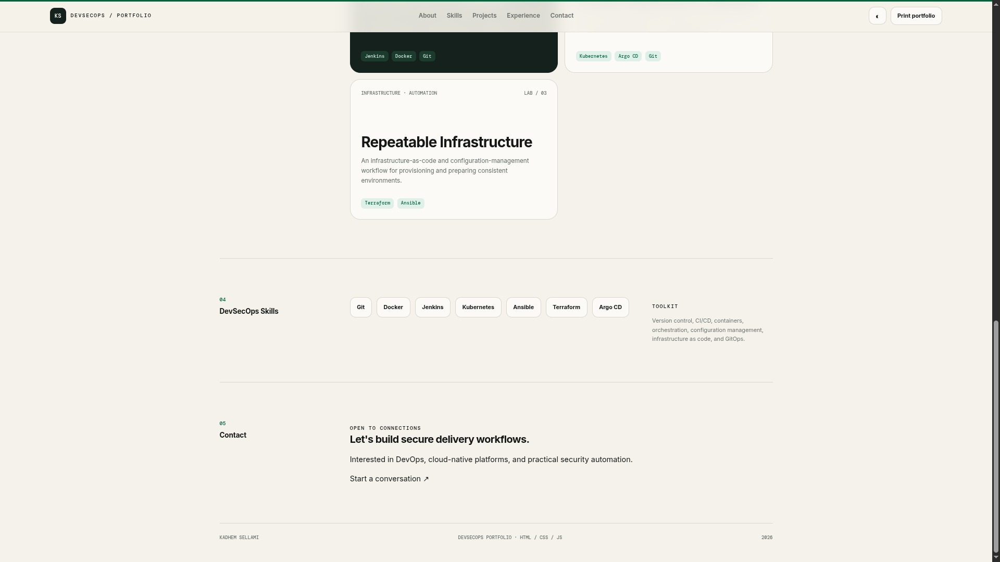

## 10.2. JavaScript Projects Section
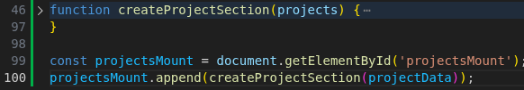

---

# 1. Installation de Debian13 6.12 et configuration de SSH

## Installation de la VM (KVM)

Une machine virtuelle a été créée avec **Debian13 6.12**.

Configuration utilisée :

* CPU : `2`
* RAM : `3GB`
* Disque : `30`
* Réseau : `NAT`
* Hostname : `debkvm`

Après l'installation, le système a été mis à jour :

```bash
sudo apt update
sudo apt upgrade -y
```

### Capture d'écran — Configuration SSH

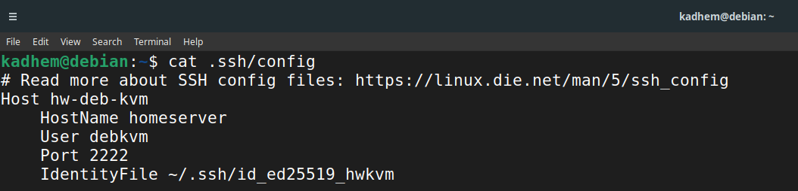

---

# 2. Test de l'accès SSH depuis la machine physique

Depuis la machine physique, la connexion SSH a été effectuée avec :

```bash
ssh hw-deb-kvm
```

Lors de la première connexion, l'empreinte du serveur a été acceptée.

Une fois connecté, l'identité de la machine a été vérifiée :

```bash
hostname
```

et :

```bash
whoami
```

### Résultat

La connexion SSH à la VM Ubuntu Server a été réalisée avec succès depuis la machine physique.

### Capture d'écran — Connexion SSH

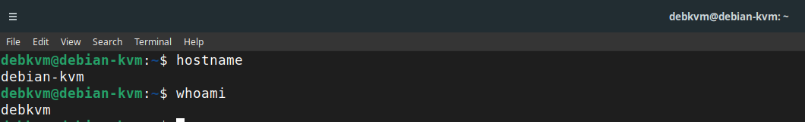

---

# 3. Installation de Docker

## 3.1 Mise à jour du système

```bash
sudo apt update
```

## 3.2 Installation des dépendances

```bash
sudo apt install ca-certificates curl -y
```

## 3.3 Ajout du dépôt Docker

Création du répertoire contenant les clés :

```bash
sudo install -m 0755 -d /etc/apt/keyrings
```

Téléchargement de la clé GPG Docker :

```bash
sudo curl -fsSL https://download.docker.com/linux/ubuntu/gpg \
  -o /etc/apt/keyrings/docker.asc
```

Modification des permissions :

```bash
sudo chmod a+r /etc/apt/keyrings/docker.asc
```

Ajout du dépôt Docker :

```bash
echo \
  "deb [arch=$(dpkg --print-architecture) signed-by=/etc/apt/keyrings/docker.asc] https://download.docker.com/linux/ubuntu \
  $(. /etc/os-release && echo "${UBUNTU_CODENAME:-$VERSION_CODENAME}") stable" | \
  sudo tee /etc/apt/sources.list.d/docker.list > /dev/null
```

Mise à jour de la liste des paquets :

```bash
sudo apt update
```

## 3.4 Installation de Docker Engine

```bash
sudo apt install docker-ce docker-ce-cli containerd.io docker-buildx-plugin docker-compose-plugin -y
```

## 3.5 Vérification

Vérification du service Docker :

```bash
sudo systemctl status docker
```

Vérification de la version :

```bash
docker --version
```

### Capture d'écran — Installation et test Docker

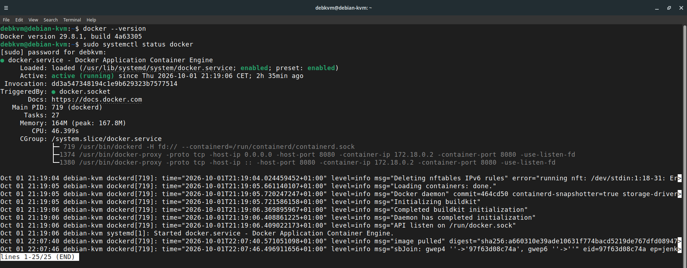

---

# 4. Installation et configuration de Jenkins

Jenkins est exécuté dans un conteneur Docker avec une configuration **Docker Compose**. Les données sont conservées dans le volume `jenkins_home`, même si le conteneur est recréé.

## 4.1 Création du fichier Compose

Création d'un dossier dédié sur la VM :

```bash
mkdir -p ~/jenkins
cd ~/jenkins
```

Création du fichier `compose.yaml` :

```bash
nano compose.yaml
```

Contenu du fichier :

```yaml
services:
  jenkins:
    image: jenkins/jenkins:lts-jdk21
    container_name: jenkins
    restart: unless-stopped
    ports:
      - "8080:8080"
    volumes:
      - jenkins_home:/var/jenkins_home

volumes:
  jenkins_home:
```

## 4.2 Démarrage et vérification

Téléchargement de l'image et démarrage de Jenkins en arrière-plan :

```bash
docker compose up -d
```

Vérification de l'état du conteneur :

```bash
docker compose ps
```

Consultation des journaux de démarrage :

```bash
docker compose logs -f jenkins
```

Pour quitter l'affichage des journaux, utiliser `Ctrl+C`. Jenkins continue de fonctionner en arrière-plan.

### Récupération du mot de passe initial

```bash
docker compose exec jenkins cat /var/jenkins_home/secrets/initialAdminPassword
```

Le mot de passe obtenu est utilisé lors de la première configuration de Jenkins.

## 4.3 Accès depuis la machine physique

Depuis le navigateur de la machine physique :

```text
http://<VM_IP>:8080
```

Exemple :

```text
http://192.168.122.50:8080
```

L'interface Web de Jenkins est alors accessible depuis la machine physique. Le port `8080` doit être autorisé par le pare-feu de la VM et accessible sur le réseau.

### Capture d'écran — Interface Web Jenkins

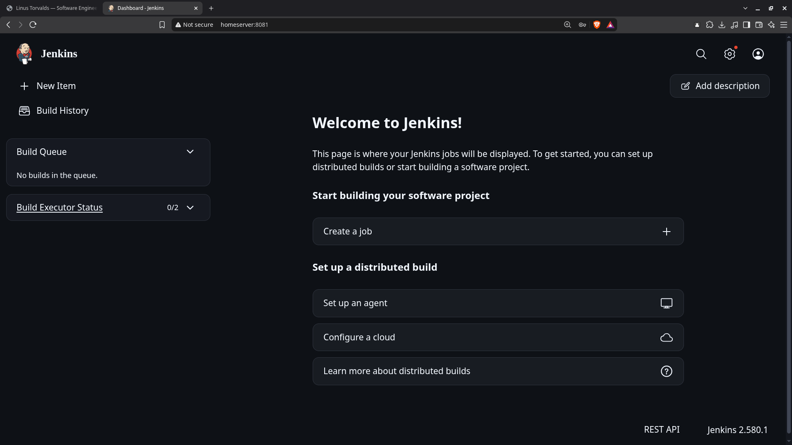

---

# 5. Création d'un mini CV One Page

Un mini CV One Page a été développé avec :

* HTML5
* CSS3
* JavaScript

## 5.1 Structure du projet

```text
web-cv/
├── index.html
│── style.css
|── script.js
```

## 5.2 Initialisation du dépôt Git

Création du dossier :

```bash
mkdir web-cv
cd web-cv
```

Initialisation du dépôt :

```bash
git init
```

Ajout des fichiers :

```bash
git add .
```

Création du premier commit :

```bash
git commit -m "Init"
```

### Capture d'écran — Mini CV

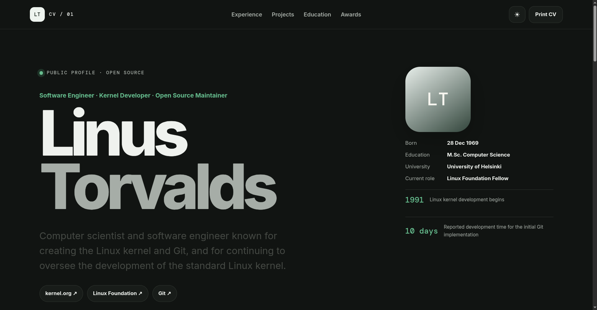

---

# 6. Activation des Push GitHub via SSH

## 6.1 Vérification de Git

```bash
git --version
```

## 6.2 Génération d'une clé SSH

Une clé SSH a été générée pour permettre l'authentification auprès de GitHub :

```bash
ssh-keygen -t ed25519 -C "<GITHUB_EMAIL>"
```

Lorsque demandé, un emplacement et éventuellement une passphrase ont été définis.

Les clés sont généralement créées dans :

```text
~/.ssh/
```

Vérification :

```bash
ls -la ~/.ssh
```

La clé publique correspondante est :

```text
~/.ssh/id_ed25519.pub
```

## 6.3 Affichage de la clé publique

```bash
cat ~/.ssh/id_ed25519.pub
```

La clé publique a été copiée.

### Capture d'écran — Clé SSH publique


> **Important :** seule la clé publique `id_ed25519.pub` doit être copiée vers GitHub. La clé privée `id_ed25519` ne doit jamais être partagée.

---

## 6.4 Ajout de la clé dans GitHub

Dans GitHub :

```text
Settings
    ↓
SSH and GPG keys
    ↓
New SSH key
```

Un nom a été donné à la clé :

```text
Ubuntu Server VM
```

La clé publique générée précédemment a été collée dans le champ correspondant, puis enregistrée.

### Capture d'écran — Clé ajoutée à GitHub


---

## 6.5 Test de la connexion SSH à GitHub

La connexion a été testée avec :

```bash
ssh -T git@github.com
```

Un message similaire à celui-ci confirme l'authentification :

```text
Hi <GITHUB_USERNAME>! You've successfully authenticated,
but GitHub does not provide shell access.
```

### Capture d'écran — Test GitHub SSH


---

## 6.6 Configuration du dépôt local avec SSH

Affichage de l'URL actuelle du dépôt :

```bash
git remote -v
```

Configuration de l'URL SSH :

```bash
git remote set-url origin git@github.com:<GITHUB_USERNAME>/<REPOSITORY>.git
```

Vérification :

```bash
git remote -v
```

Résultat :

```text
origin  git@github.com:<GITHUB_USERNAME>/<REPOSITORY>.git (fetch)
origin  git@github.com:<GITHUB_USERNAME>/<REPOSITORY>.git (push)
```

### Capture d'écran — Remote Git configuré en SSH


---

## 6.7 Test du Push

Après une modification du CV :

```bash
git status
```

Puis :

```bash
git add .
git commit -m "Update CV"
```

Enfin :

```bash
git push origin main
```

Le push est effectué via SSH sans demander le mot de passe GitHub.

### Capture d'écran — Git Push


---

# 7. Résumé des réalisations

| Étape | Réalisation                        | Statut |
| ----- | ---------------------------------- | ------ |
| 1     | Installation Debian13 6.12   | ✅      |
| 2     | Accès distant SSH                  | ✅      |
| 3     | Installation Docker                | ✅      |
| 4     | Installation Jenkins comme service | ✅      |
| 5     | Création du mini CV One Page       | ✅      |
| 6     | Configuration GitHub SSH + Push    | ✅      |

---

# 8. Liens

### Dépôt GitHub

`<GITHUB_REPOSITORY_URL>`

### CV

`<CV_URL_IF_DEPLOYED>`

---

# 9. Captures d'écran

Les captures d'écran utilisées dans ce README sont stockées dans :

```text
screenshots/
├── 01-ssh-server.png
├── 02-ssh-test.png
├── 03-docker.png
├── 04-jenkins-service.png
├── 05-jenkins-web.png
├── 06-web-cv.png
├── 07-ssh-public-key.png
├── 08-github-ssh-key.png
├── 09-github-ssh-test.png
├── 10-git-remote-ssh.png
└── 11-git-push.png
```
